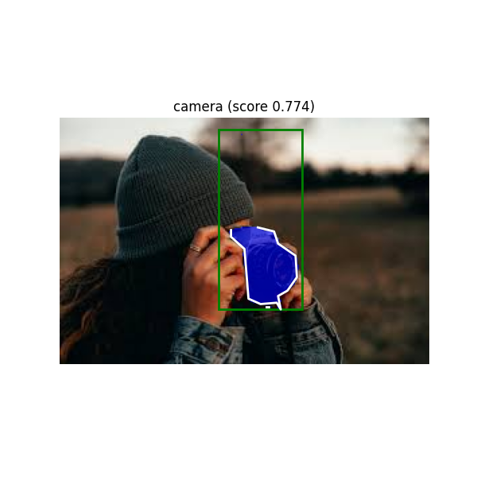

# Zero-shot mask generation using VLM models

# Requirements

1. HuggingFace 
2. SAM2 installation (from official repository)

 # Inference Results

<table>
  <tr>
    <td>
      

        
         
        <strong>Input Image</strong>
      

    </td>
    <td>
      

        
         
        <strong>Prediction Image</strong>
      

    </td>
  </tr>
</table>
